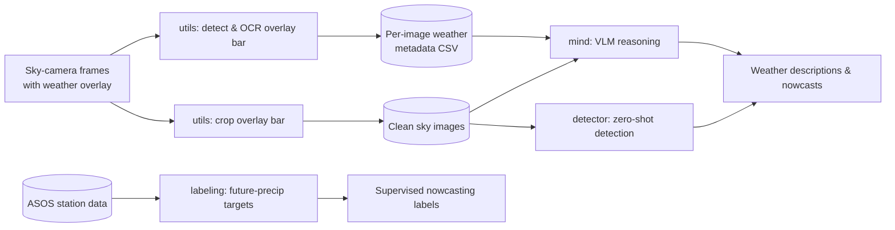

# WeatherMind

> An AI framework for understanding weather from ground-level sky-camera imagery, combining vision-language models, open-vocabulary detection, and physical weather-station data into one reasoning pipeline.

## Overview

A fixed outdoor camera that photographs the sky every few minutes is one of the cheapest weather sensors there is — but its frames are unstructured pixels, not measurements. **WeatherMind turns those frames into weather understanding.**

The framework wraps several state-of-the-art vision-language models (VLMs) and zero-shot detectors behind a single, model-agnostic interface, and — crucially — lets them reason about an image *together with* the real weather-station readings recorded at that same timestamp. It can describe a scene, infer cloud cover and visibility, detect precipitation and lens artifacts, and produce supervised labels for short-range precipitation **nowcasting**.

The project was developed as a research prototype at the **GAIM Lab, University of Georgia** (advisor: Prof. Weiming Hu), using a single weather camera in Baxley, Georgia (`cam_id 7410`) cross-referenced against NWS **ASOS** station observations.

## Why it's interesting

A few design decisions set this apart from a typical "caption an image" demo:

- **Model-agnostic abstraction.** Four very different VLMs (Qwen2-VL, SmolVLM2, Moondream2, Gemma 3) and four detectors (Grounding DINO, OWL-ViT, MM Grounding DINO, LLMDet) sit behind one uniform `(image, question) -> answer` / `detect(image, tags)` API. Swapping backends is a one-line change, which makes systematic comparison trivial.
- **A self-supervising data loop.** The cameras stamp a weather overlay onto each frame. WeatherMind **OCRs that overlay into structured metadata**, then **crops it off** so the model never "cheats" by reading the printed numbers — the same artifact becomes both free labels and a fairness safeguard.
- **Image + sensor fusion.** Station readings (temperature, humidity, pressure, wind, gusts, rainfall) over a configurable look-back window are serialized into natural-language context and fused into the prompt, so the model reasons from *pixels and physics* at once.
- **Physically grounded targets.** Precipitation labels are derived from official ASOS data at a chosen lead time, with automatic detection of each station's reporting interval — not hand-waved heuristics.

## How it works



## Repository structure

```
WeatherMind/
├── weather_mind/            # Installable Python package
│   ├── __init__.py
│   ├── mind.py              # VLM orchestration + weather-metadata fusion
│   ├── detector.py          # Zero-shot open-vocabulary weather detection
│   ├── labeling.py          # ASOS-derived precipitation nowcasting labels
│   └── utils.py             # Overlay-bar detection, cropping, and OCR
├── notebooks/               # Exploration, demos, and case studies
├── pyproject.toml
├── LICENSE
└── README.md
```

| Module | Responsibility |
| --- | --- |
| `weather_mind/mind.py` | Unified VLM interface (Qwen2-VL, SmolVLM2, Moondream2, Gemma 3) with optional fusion of weather-station context over a configurable time window. |
| `weather_mind/detector.py` | Open-vocabulary detection of weather phenomena (clouds, fog, smoke, rain, lens artifacts, wet/icy surfaces) across four zero-shot detectors, plus cloud-base elevation-angle geometry. |
| `weather_mind/labeling.py` | Builds binary or regression precipitation targets from ASOS observations at a chosen lead time, auto-detecting the station's record interval. |
| `weather_mind/utils.py` | Estimates and crops the camera's bottom overlay bar, and OCRs it into a structured per-image weather CSV. |

## Tech stack

**Core:** Python 3.10+ · PyTorch · Hugging Face Transformers · Pillow · pandas · NumPy
**OCR:** Tesseract (via `pytesseract`)
**Notebooks / research:** PyTorch Lightning · Captum (interpretability) · matplotlib

**Models integrated**

| Task | Backends |
| --- | --- |
| Vision-language reasoning | `Qwen/Qwen2-VL-2B-Instruct` · `HuggingFaceTB/SmolVLM2-2.2B-Instruct` · `vikhyatk/moondream2` · `google/gemma-3-4b-it` |
| Zero-shot detection | `IDEA-Research/grounding-dino-base` · `google/owlvit-base-patch32` · `mm_grounding_dino_tiny` · `iSEE-Laboratory/llmdet_large` |

## Notebooks

| Notebook | What it demonstrates |
| --- | --- |
| `weathermind_demo.ipynb` | End-to-end VLM reasoning with weather-context fusion across multiple models and look-back windows. |
| `helene.ipynb` | Case study: Hurricane Helene (2024) over Baxley, GA — meteorological prompting (eyewall vs. outer bands, wind-force inference) with 3 h / 12 h context. |
| `temperature.ipynb` | Fine-tunes a ViT to regress temperature from sky images (PyTorch Lightning) and uses Captum Integrated Gradients to visualize what the model attends to. |
| `detector.ipynb` | Side-by-side comparison of the four zero-shot detectors on the same frames. |
| `additonal-vqas.ipynb` | Exploratory visual-question-answering with Qwen2-VL. |
| `blip-vqa-test.ipynb` | BLIP-VQA baseline probe. |
| `test.ipynb` | Validation of the labeling and OCR/cropping pipelines, including ASOS interval auto-detection. |
| `demo.ipynb` | Minimal package skeleton. |

## License

Released under the [MIT License](LICENSE).
